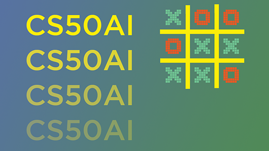
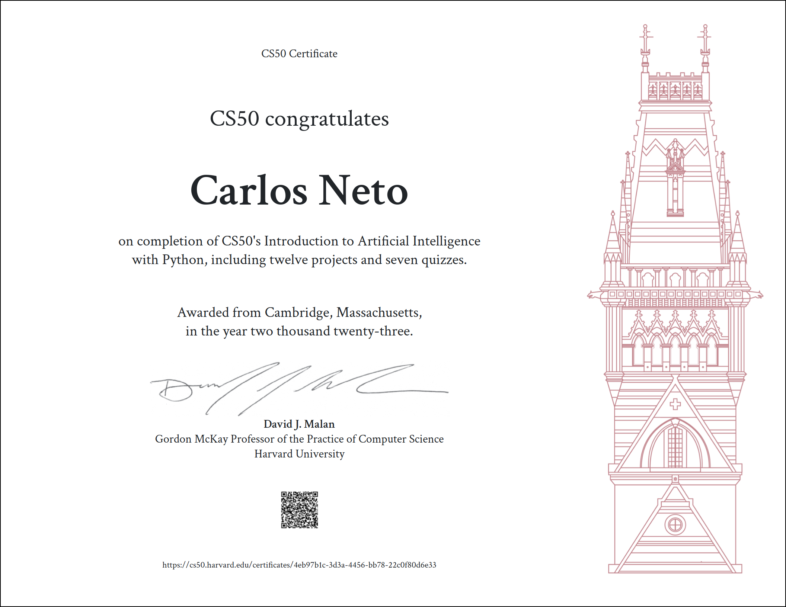

# CS50’s Introduction to Artificial Intelligence with Python

Before reading the files in this repository, please remember the [Academic Honesty](https://cs50.harvard.edu/ai/2020/honesty/).\
These files serve to give you a sense of how to solve the problems **if** you feel lost.\
Do not copy and paste any of these files. Try to solve the problems yourself!

## Submissions

* **[Search](search)**
    - [Degrees](search/degrees)
    - [Tic-Tac-Toe](search/tictactoe)

* **[Knowledge](knowledge)**
    - [Knights](knowledge/knights)
    - [Minesweeper](knowledge/minesweeper)

* **[Uncertainty](uncertainty)**
    - [Heredity](uncertainty/heredity)
    - [PageRank](uncertainty/pagerank)

* **[Optimization](optimization)**
    - [Crossword](optimization/crossword)

* **[Learning](learning)**
    - [Nim](learning/nim)
    - [Shopping](learning/shopping)

* **[Neural Network](neural-network)**
    - [Traffic](neural-network/traffic)

* **[Language](language)**
    - [Attention](language/attention)
    - [Parser](language/parser)

## Certificate

